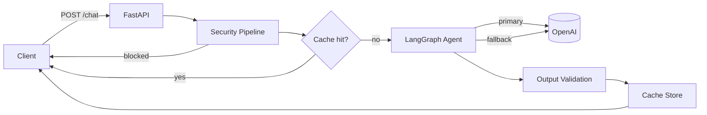

# Airlock

**A FastAPI gateway for LangGraph agents — everything in and out gets inspected.**

A reference FastAPI service that wraps a LangGraph agent with security filtering, response caching, rate limiting, structured logging, and observability hooks. It demonstrates patterns that are useful when moving an LLM-powered API toward production, but it is not intended to be deployed unchanged as a fully production-ready system.

> **Project scope:** This repository is an educational and architectural baseline. Production readiness depends on your traffic, availability targets, data sensitivity, compliance requirements, infrastructure, and operational practices.

## Features

- **LangGraph agent** — State machine with primary model invocation, automatic fallback on failure, and graceful error handling
- **Security pipeline** — Prompt-injection detection, PII masking on input/output, and harmful-content filtering
- **Response cache** — In-memory TTL cache with case-insensitive deduplication to reduce LLM cost and latency
- **Rate limiting** — Per-IP request throttling via SlowAPI (configurable, default `20/minute`)
- **Observability** — JSON structured logging, in-process metrics, and LangSmith tracing on key paths
- **Container baseline** — Docker image with a non-root user, health-check configuration, and Docker Compose support
- **Test coverage** — 30 unit/integration tests with mocked LLM calls (no API keys required to run tests)

## Architecture



### Request flow (`POST /chat`)

1. **Security check** — Block prompt-injection patterns; mask PII before it reaches the LLM
2. **Cache lookup** — Return immediately on hit (model reported as `cache`)
3. **Agent invoke** — Run the LangGraph state machine against OpenAI
4. **Output validation** — Mask leaked PII and block harmful responses
5. **Cache store** — Persist the validated response for future identical queries
6. **Metrics + logging** — Record latency, token estimates, and security notes

## Project structure

```text
airlock/
├── app/
│   ├── main.py          # FastAPI app, endpoints, lifespan wiring
│   ├── agent.py         # LangGraph agent (primary → fallback → error)
│   ├── security.py      # Input sanitization, PII detection, output validation
│   ├── cache.py         # In-memory TTL response cache
│   ├── monitoring.py    # JSON logging and metrics collector
│   ├── models.py        # Pydantic request/response schemas
│   └── config.py        # Environment-based settings (pydantic-settings)
├── tests/
│   ├── test_api.py      # Endpoint integration tests (mocked agent)
│   ├── test_security.py # Security layer unit tests
│   └── test_cache.py    # Cache layer unit tests
├── Dockerfile
├── docker-compose.yml
├── pyproject.toml
└── .env.example
```

## Prerequisites

- Python 3.12+
- [uv](https://docs.astral.sh/uv/) (recommended) or pip
- OpenAI API key
- LangSmith API key (optional, for tracing)

## Quick start

### 1. Clone and configure

```bash
git clone git@github.com:henrylong719/airlock.git
cd airlock
cp .env.example .env
# Edit .env and set OPENAI_API_KEY (and LANGCHAIN_API_KEY if tracing is enabled)
```

### 2. Install dependencies

```bash
uv sync
```

### 3. Run the server

```bash
uv run uvicorn app.main:app --reload --host 0.0.0.0 --port 8000
```

The API is available at `http://localhost:8000`. Interactive docs at `http://localhost:8000/docs`.

### 4. Send a chat request

```bash
curl -X POST http://localhost:8000/chat \
  -H "Content-Type: application/json" \
  -d '{"message": "What is the capital of France?", "thread_id": "demo-1"}'
```

Example response:

```json
{
  "response": "The capital of France is Paris.",
  "thread_id": "demo-1",
  "model_used": "primary",
  "cached": false,
  "processing_time_ms": 842.15,
  "security_notes": [],
  "timestamp": "2026-07-12T05:30:00.000000+00:00"
}
```

## Docker

```bash
docker compose up --build
```

The service listens on port `8000` and defines a health check against `/health`. The container runs as a non-root user and uses `uv sync --frozen --no-dev` for reproducible installs.

This setup is a deployment starting point, not a complete production image. In particular, the current health-check command uses `curl`, which may need to be installed in the slim image or replaced with a Python-based check.

## Configuration

All settings are loaded from environment variables (or `.env`) via `pydantic-settings`. See `.env.example` for a starting template.

| Variable | Default | Description |
| --- | --- | --- |
| `OPENAI_API_KEY` | — | OpenAI API key (required for live LLM calls) |
| `PRIMARY_MODEL` | `gpt-4o-mini` | Model used for the first invocation attempt |
| `FALLBACK_MODEL` | `gpt-4o-mini` | Model used when the primary call fails |
| `LANGCHAIN_TRACING_V2` | `true` | Enable LangSmith tracing |
| `LANGCHAIN_API_KEY` | — | LangSmith API key |
| `LANGCHAIN_PROJECT` | `production-api` | LangSmith project name |
| `APP_ENV` | `development` | Environment label (`production` in Docker Compose) |
| `LOG_LEVEL` | `INFO` | Application log level |
| `RATE_LIMIT` | `20/minute` | SlowAPI rate limit per client IP |
| `CACHE_TTL_SECONDS` | `300` | Cache entry lifetime in seconds |
| `MAX_RETRIES` | `3` | Max fallback attempts before returning a graceful error |

## API reference

| Method | Path | Description |
| --- | --- | --- |
| `POST` | `/chat` | Send a message to the agent |
| `GET` | `/health` | Health check for load balancers and orchestrators |
| `GET` | `/metrics` | Aggregated request metrics (latency, errors, cache hit rate, tokens) |
| `GET` | `/cache/stats` | Cache performance statistics |
| `GET` | `/docs` | Swagger UI (auto-generated) |

### `POST /chat`

#### Request body

```json
{
  "message": "string (1–10,000 chars, required)",
  "thread_id": "string (optional, default: \"default\")"
}
```

#### Response fields

| Field | Type | Description |
| --- | --- | --- |
| `response` | string | Agent reply (or cached value) |
| `thread_id` | string | Echo of the request thread ID |
| `model_used` | string | `primary`, `fallback`, `cache`, `error_handler` |
| `cached` | boolean | Whether the response came from cache |
| `processing_time_ms` | float | End-to-end processing time |
| `security_notes` | string[] | PII masking or output-validation warnings |
| `timestamp` | string | UTC ISO-8601 timestamp |

#### Error codes

| Status | Condition |
| --- | --- |
| `400` | Message blocked by security filters |
| `422` | Invalid request body (e.g. empty message) |
| `429` | Rate limit exceeded |
| `500` | Agent invocation failure |
| `503` | Service still starting up |

## LangGraph agent

The agent is a three-node state machine compiled in `app/agent.py`:

```text
START → process (primary model)
          ├─ success → END
          ├─ failure → fallback (secondary model)
          │               ├─ success → END
          │               └─ failure → error (graceful message) → END
          └─ max retries exceeded → error → END
```

Retry logic is handled at the graph level (not via the OpenAI client's built-in retries), so failures are visible in LangSmith traces and can route to the fallback model.

## Security

The `SecurityPipeline` runs on every `/chat` request:

### Input

- Regex-based prompt-injection detection (e.g. "ignore previous instructions", jailbreak patterns)
- Delimiter stripping (`---`, `===`, template braces)
- PII masking for email, phone, SSN, and credit card numbers before the LLM sees the text

### Output

- PII re-detection and masking in LLM responses
- Blocking of responses matching harmful-content patterns

Blocked injection attempts return `400`. Security actions are recorded in `security_notes` on successful responses.

> **Note:** This is a baseline guardrail layer. For production deployments handling sensitive data, complement it with WAF rules, authn/authz, content moderation APIs, and regular red-team testing.

## Observability

- **Structured JSON logs** — Every log line is JSON-formatted for ingestion by ELK, Datadog, CloudWatch, etc.
- **`/metrics` endpoint** — In-process counters for requests, errors, latency, cache hit rate, and token estimates
- **LangSmith tracing** — `@traceable` decorators on the chat endpoint, security checks, and agent invocation

For higher-scale or multi-instance deployments, replace the in-memory cache with a shared store such as **Redis** and export metrics through a system such as **Prometheus**.

## Testing

```bash
uv run pytest
```

Tests are split into three modules and do not call external APIs:

- `tests/test_security.py` — Injection detection, PII masking, output validation
- `tests/test_cache.py` — TTL expiration, case-insensitive keys, stats
- `tests/test_api.py` — Full endpoint flow with a mocked agent

To run a specific module:

```bash
uv run pytest tests/test_security.py -v
```

## Known limitations and production gaps

The repository intentionally keeps several concerns simple. Before using it for a real production workload, evaluate and address the following:

| Area | Current implementation | Typical production direction |
| --- | --- | --- |
| Authentication | No authentication or authorization | API keys, OAuth/OIDC, mTLS, and endpoint-level authorization |
| Cache | In-memory dictionary | Redis or another shared store with bounded capacity and shared TTL |
| Rate limiting | Per-process, client-IP based | Distributed rate limiting tied to authenticated consumers |
| Metrics | In-process counters | Prometheus/OpenTelemetry with durable dashboards and alerting |
| Health checks | Verifies local component initialization | Separate liveness/readiness checks, including critical dependencies |
| Conversation state | `thread_id` is echoed but not persisted | LangGraph checkpointer backed by durable storage |
| LLM resilience | Primary and fallback use the same provider by default | Independent models/providers, circuit breakers, budgets, and timeouts |
| Security | Regex-based baseline guardrails | Layered moderation, WAF controls, authorization, audit logs, and red-team testing |
| Cache key | Normalized message text only | Include model, prompt, tenant, policy, and configuration versions |
| Concurrency | Synchronous model invocation inside an async endpoint | Async model calls or explicit worker/thread offloading |
| Operational endpoints | Metrics and cache statistics are public | Restrict them to trusted networks or authenticated operators |
| Delivery | Local tests and container configuration | CI/CD, image scanning, dependency updates, load tests, rollback, and incident procedures |

The existing Docker setup, tests, guardrails, and observability hooks are useful foundations. They should be treated as examples to extend and validate against concrete service-level objectives—not as a guarantee of production readiness.

## License

MIT — see [LICENSE](LICENSE).
